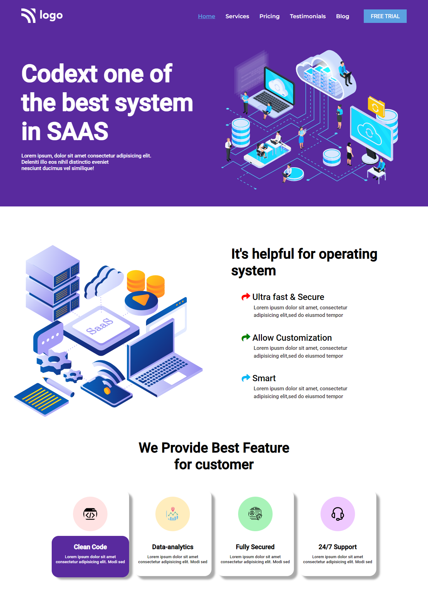
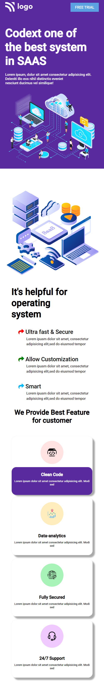

# Project 13

## SAAS Landing Page

### 💻 A Landing Page of a SAAS-Codext. 🖥️

  

#### Built Using HTML & CSS (Desktop 💻 & Mobile 📱 view only)

#### Time Taken to finish the Project - 3.30 hours ⌛ (approx)

---

## Things learned from project -

- 
- 
- 
- 
- 

---

## Live Link [Demo](https://manas-ranjan-murmu-project13.netlify.app/)

### Screenshot

---

### Mobile View ScreenShot

